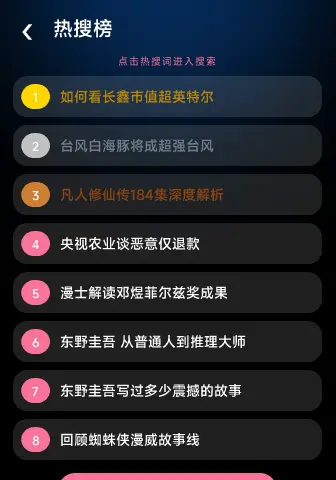

# 腕上哔哩-WristBili

专门为小米Vela量身定制的第3方B站
欢迎使用WristBiliv2.0.0补丁版本感谢你的支持！为了您享受更卓越的体验，我们强烈建议您升级到此版本！！！
1.推出WristBiIi2.0新操作新体验
2.个人页面优化
3.历史收藏上限改为20个
4.稍后再看缓存视频界面大改
5.历史收藏界面大改
6.修复其他已知问题提升用户体验

|  |  |
| --- | --- |
| 资源 ID | `com.example.band.bilibili.lite` |
| 类型 | 快应用（quick_app） |
| 作者 | Velvetine |
| 付费类型 | 免费 |
| 标签 | WristBili / 腕上哔哩 / B站 |

## 支持设备

- Xiaomi Smart Band 9 Pro（xmb9p）
- REDMI Watch 5（xmrw5）
- REDMI Watch 5 eSIM（xmrw5xring）
- REDMI Watch 6（xmrw6）
- Xiaomi Watch S4（xmws4）
- Xiaomi Watch S4 41mm（xmws441）
- Xiaomi Watch S4 15th Anniversary（xmws4xring）
- Xiaomi Watch S5（xmws5）

## 下载

| 文件 | 版本 | 设备 |
| --- | --- | --- |
| [0-6a5ef1aa05e40363b5387be7_WristBiliv2.0.0.rpk](downloads/0-6a5ef1aa05e40363b5387be7_WristBiliv2.0.0.rpk) | 2.0.0 | Xiaomi Smart Band 9 Pro（xmb9p） REDMI Watch 5（xmrw5） REDMI Watch 5 eSIM（xmrw5xring） REDMI Watch 6（xmrw6） Xiaomi Watch S4（xmws4） Xiaomi Watch S4 41mm（xmws441） Xiaomi Watch S4 15th Anniversary（xmws4xring） Xiaomi Watch S5（xmws5） |

## 预览

---

本仓库由 [OronBox 创作者中心](https://oronbox.zxor.org) 创建和维护。This repository is created and maintained by OronBox Creator Center.
